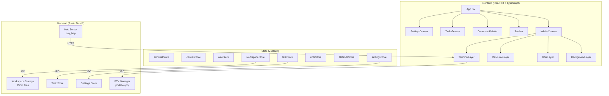
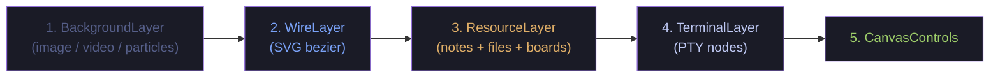
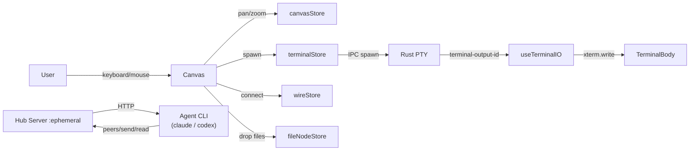
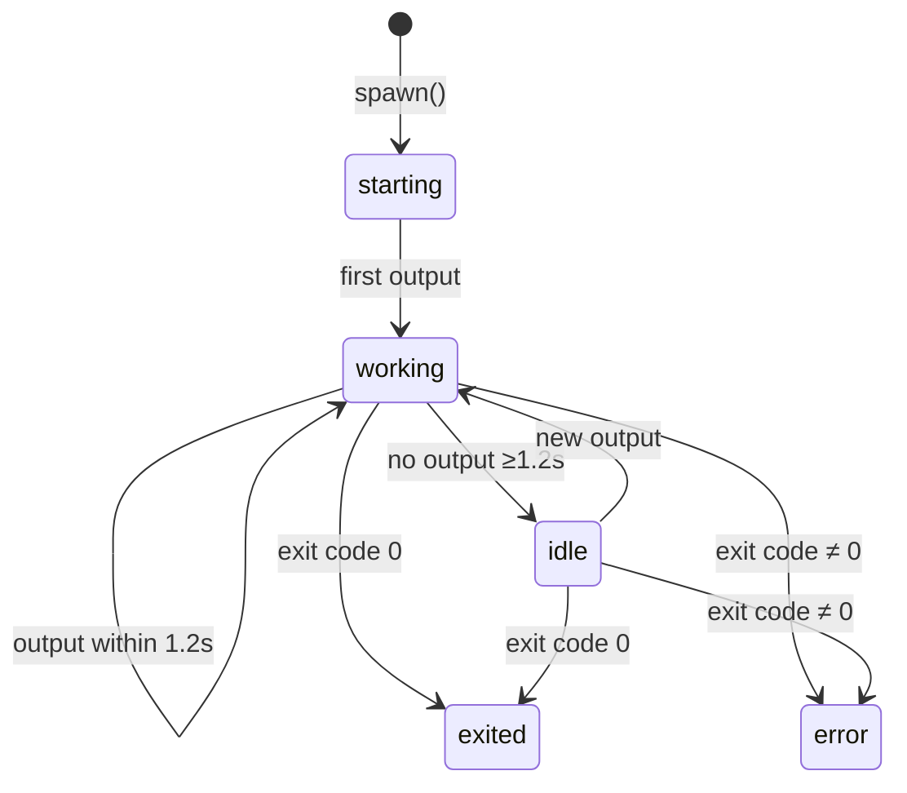

# Wodouyao

[English](./README.md) · [中文](./README_zh.md)

> An infinite-canvas terminal orchestrator where **carbon** (you) and **silicon** (agents) stare at the same world.

Built on **Tauri 2** (Rust) + **React 19** + **TypeScript**.


---

## 🧬 Two Lenses

Wodouyao is not a harness — it is a **stage shared between two species**:

- 🧍 **Carbon-side** — you lean against the glass: activity dots, colored wires, drag tasks onto terminals, `Ctrl+K` summons the palette.
- 🤖 **Silicon-side** — agents reach through the hub HTTP API: discover peers, inject keystrokes, read output, join teams.

Same terminal node, two ways to open it:

| Scene | 🧍 Carbon sees | 🤖 Silicon sees |
|---|---|---|
| A new terminal appears on the canvas | A window with a status dot and drag handles | A new entry in `/v1/peers` JSON |
| You draw a wire | A bezier curve with a tooltip | An ACL peer was granted |
| You press Enter | Your local PTY runs the line | Every `io` peer receives `\r` |

---

## ✨ Features

### 🖼 Canvas & Terminals

- Infinite zoomable canvas. Real PTY terminals, resizable from any edge or corner, rAF-throttled for smoothness.
- WebGL renderer (Canvas fallback) + JetBrainsMono → SF Mono → Menlo font stack.
- 5 xterm themes (Tokyo Night, Dracula, Nord, Monokai, Solarized) + 8 accent colors.

### 🪢 Wires & IO

- Typed wires: `io` (terminal↔terminal), `note`, `file`, `board` (task boards), `team`.
- `io` wires mirror every keystroke (Enter, Ctrl-*, arrows) to the peer PTY — true input fan-out.
- Drop a wire on empty canvas to auto-spawn an agent terminal (configurable command).

### 🛰 Silicon Protocol (Hub)

- Embedded `tiny_http` hub on an ephemeral loopback port, Bearer-authenticated.
- Endpoints: `/v1/peers`, `/v1/whoami`, `/v1/send`, `/v1/read`, `/v1/watch`, `/v1/spawn`, `/v1/teams/*`, `/v1/tasks/*`.
- Ships a POSIX `wodouyao` CLI and Claude Code / Codex skills that auto-install.
- tmux-style key-literal parser (`Enter`, `C-c`, `C-Left`, `Escape`, …).

### 🎭 Orchestration Panel

- Role tags (pm / architect / backend / frontend / qa / devops / designer / planner / generator / evaluator / researcher / shell) with color glyphs.
- Activity dots (working / idle / starting / exited / error) with pulse animation.
- Task panel with drag-to-assign; task boards themselves can be wired.
- Teams with star topology (lead = wire source) and palette-based auras.

### 💾 Workspaces & Settings

- Save / load / switch full canvas layouts (terminals + wires + tasks + notes + teams).
- Fork a workspace as a parallel experiment branch.
- Backgrounds: image / video / URL / particle preset (matrix / starfield / wave / dust).
- Language switch (zh / en), shell picker, font size, default create behavior, wire-to-empty config.

---

## 🚧 Optimization Backlog

### 🧍 What carbon wants

1. **Onboarding tour** — an interactive first-run tour demonstrating spawn → wire → team.
2. **Undo stack** — `⌘Z` to restore an accidentally deleted terminal or wire.
3. **Keyboard-first** — arrow-navigate between terminals, `⌘/` toggle palette, Tab cycle focus.
4. **Toast feedback** — visible confirmations for auto-save, workspace switch, hub install outcomes.
5. **A11y** — aria-labels, high-contrast theme, screen-reader-friendly wire summaries.
6. **Light theme** — a light theme for daylight users (dark is hardcoded today).
7. **Custom themes & fonts** — let users import their own xterm themes and font families.
8. **Trackpad polish** — pinch-zoom and two-finger pan refinement.
9. **User handbook** — a handbook aimed at non-developers using it as a tool.
10. **Surface errors** — surface Rust-side errors outside of the DevTools console.

### 🤖 What silicon wants

1. **Per-terminal scope token** — replace the single global bearer with per-terminal scoped tokens honoring the peer ACL.
2. **Heartbeat** — a `POST /v1/heartbeat` so disconnected agents are flagged stale.
3. **Idempotency** — accept `Idempotency-Key` on `/v1/send` to survive retries.
4. **Atomic batch** — a batch endpoint for spawn + wire + send to avoid intermediate states.
5. **Rate limit** — 429 + `Retry-After` to prevent a burst from blowing up the PTY.
6. **Richer peer metadata** — include role / shell / cwd / status / cols×rows in `/v1/peers`.
7. **Resumable watch** — `since=<offset>` so disconnects don't drop output.
8. **OpenAPI schema** — publish OpenAPI so clients can be generated.
9. **Identity persistence** — persist agent identities across restarts.
10. **Structured errors** — normalize error bodies to `{code, message, hint}`.
11. **Metrics endpoint** — `/v1/metrics` for self and peer observability.
12. **Media-type versioning** — `Accept: application/vnd.wodouyao.v1+json` for breaking changes.
13. **Frontend tests + CI** — add Vitest and GitHub Actions; only Rust integration tests exist today.
14. **Structured logs** — replace `println!`/`eprintln!` with structured `tracing` JSON.
15. **Causality tracing** — propagate span IDs across mirrored input so cross-terminal causality is traceable.

---

## 🏛 Architecture



### Rendering Layers (bottom → top)



### Data Flow



### Terminal Activity State Machine



---

## 🧰 Getting Started

### Prerequisites

- [Node.js](https://nodejs.org/) >= 18
- [Rust](https://rustup.rs/) (stable)
- [Tauri CLI](https://v2.tauri.app/start/prerequisites/) v2
- Platform toolchain: Visual Studio Build Tools (Windows), Xcode (macOS).

### Commands

```bash
# Install JS deps
npm install

# Dev mode (hot-reload frontend + Rust backend)
npm run tauri dev

# Production build
npm run tauri build

# TypeScript check only
npx tsc --noEmit
```

### Headless server mode (browser-side UI)

The same Rust core can run as a headless HTTP+WebSocket server so you
can drive the canvas — including PTY terminals, Claude / Codex
sessions, and the hub — from a browser on another machine. Useful for:
SSH-tunnelling into a workstation, running the orchestrator on a
remote dev box, or just keeping a long-lived session on a server.

```bash
# Build the SPA bundle + the headless server binary
npm run server:build

# Or dev-style (debug build, foreground)
npm run server:dev
```

When the server starts it prints a one-shot URL with the bearer token
embedded in the hash:

```
wodouyao-server listening at:
  http://127.0.0.1:54321/#token=…
```

Open that URL in any browser. The frontend reads the token from the
hash, stashes it in `sessionStorage`, and uses it for both the
`/v1/cmd/*` HTTP commands and the `/v1/events` WebSocket.

For remote use, SSH-tunnel the port:

```bash
ssh -L 54321:127.0.0.1:54321 your-server
# then on your laptop, open http://127.0.0.1:54321/#token=…
```

The headless binary listens on `127.0.0.1` only — there is **no
in-process TLS, no multi-tenant auth**. Treat the bearer token as a
shared secret and don't expose the port to the public internet
without a TLS-terminating reverse proxy in front. This mode is
intended for **single-user remote access**, not multi-tenant SaaS
deployment.

Set `WODOUYAO_DIST_DIR` to override where the server looks for the
SPA bundle (defaults to `dist/` next to the binary).

---

## 📁 Project Structure

```
src/                              # React frontend
  components/
    canvas/                       # InfiniteCanvas, WireLayer, BackgroundLayer, ResourceLayer
                                  # NoteNode, FileNode, TaskBoardNode, CanvasControls
    terminal/                     # TerminalNode, TerminalBody, TerminalTitleBar
                                  # TerminalStatusBadge, TerminalContextMenu
    ui/                           # Toolbar, SettingsDrawer, TasksDrawer, TeamsDrawer
                                  # WorkspaceSwitcher, TerminalCreateDialog, RolePicker
    command-palette/              # CommandPalette (Ctrl+K)
  hooks/                          # useCanvas, useTerminal, useTerminalIO, useKeyboard
                                  # useWorkspace, useForkWorkspace, useNewTerminal
                                  # useNodeDrag, useTasksSync, useTeamsSync
                                  # useTerminalActivity, useHubSpawn
  store/                          # Zustand stores (terminal, canvas, wire, workspace,
                                  # settings, task, team, note, fileNode, taskBoard, ...)
  services/                       # Tauri IPC wrappers, terminal registry
  types/                          # TypeScript types
  utils/                          # Themes, roles, constants, geometry, ID gen
  i18n/                           # en.json / zh.json + index.ts

src-tauri/                        # Rust backend
  src/
    pty/                          # PTY session management (portable-pty)
    commands/                     # Tauri IPC commands (terminal, workspace, settings,
                                  # agents, wire, team, tasks, file_preview)
    hub/                          # Hub HTTP server, topology, identity, teams, keys
    workspace/                    # Workspace JSON persistence
    settings/                     # App settings persistence
    tasks/, notes/                # Resource stores
    integrations/                 # Agent CLI detection + skill installer
  resources/bin/wodouyao          # Shipped POSIX CLI
  resources/skills/wodouyao/      # Shipped Claude Code / Codex skill
  tests/hub_integration.rs        # Rust integration tests
```

---

## ⌨️ Shortcuts

| Key | Action |
|---|---|
| `Ctrl+K` | Command palette |
| `F11` | Toggle fullscreen |
| `Ctrl+scroll` | Zoom canvas |
| Middle-click drag | Pan canvas |
| `Shift+click` "+ Terminal" | Skip the create dialog |

## 🧭 Canvas Modes

| Mode | Behavior |
|---|---|
| **Select** | Drag canvas to pan; drag terminal title to move it. |
| **Draw** | Drag a rectangle to spawn a terminal. |
| **Wire** | Click the source anchor, drag to a target node. |

## 🎨 Role Tags

| Role | Color | Glyph | Purpose |
|---|---|---|---|
| planner | `#bb9af7` | ◆ | Designs plans |
| generator | `#9ece6a` | ▲ | Writes code |
| evaluator | `#f7768e` | ◐ | Runs tests, reviews |
| researcher | `#7dcfff` | ? | Explores, asks questions |
| shell | `#565f89` | > | Plain shell (default) |

## 🧱 Tech Stack

| Layer | Tech |
|---|---|
| Desktop runtime | Tauri 2 |
| Backend | Rust, portable-pty, tiny_http, tokio |
| Frontend | React 19, TypeScript, Vite |
| Terminal emulator | xterm.js 5.5 + WebGL renderer (Canvas fallback) |
| State management | Zustand 5 |
| i18n | react-i18next (en / zh) |

---

## 🔧 Extending Wodouyao

### Add a terminal role

Edit `src/utils/terminalRoles.ts` — add an entry to `BUILTIN_ROLES` and a position in `ROLE_ORDER`:

```ts
// In BUILTIN_ROLES:
pm: { label: "PM", color: "var(--color-warning)", glyph: "★", hint: "coordinates work" },

// In ROLE_ORDER (insert at desired position):
"pm",
```

Users can also add custom roles via `settings.custom_roles` without code changes — see `resolveRoles()`.

### Add a skill

Create a directory under `src-tauri/resources/skills/<skill-name>/` containing at least a `SKILL.md` (description, trigger phrases, and any supporting scripts). On first run, the Tauri installer copies skills to `~/.claude/plugins/wodouyao/`. See `src-tauri/resources/skills/wodouyao/SKILL.md` for the expected format.

### Add a shader background

1. Create a GLSL fragment shader: `src-tauri/resources/shaders/<name>.frag`
2. The header must declare `u_time`, `u_resolution`, `u_mouse` uniforms and `out vec4 outColor`
3. Rebuild or restart — `shaders_list()` enumerates `~/.wodouyao/shaders/` and populates the Settings dropdown automatically
4. No registration needed; the Rust seed copies new `.frag` files from `resources/shaders/` on startup

## 🤝 Contributing

1. **Fork** the repository and create a feature branch
2. **Make your changes** — run `npx tsc --noEmit` to verify type correctness
3. **Test locally** with `npm run tauri dev`
4. **Open a pull request** with a clear title and description

Commit messages follow [Conventional Commits](https://www.conventionalcommits.org/).

## 🙏 Acknowledgments

Wodouyao (我都要) is inspired by [TheMaestri.app](https://www.themaestri.app) — a polished, production-grade macOS terminal orchestrator. If you're on a Mac, do check it out. This project is an independent, open-source, cross-platform exploration of related ideas. Respect and gratitude to the original team.

## License

MIT
