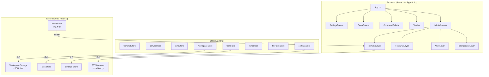
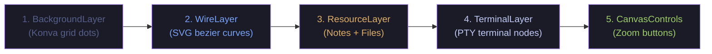
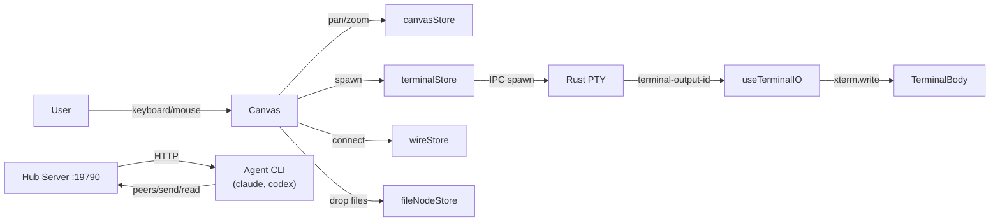
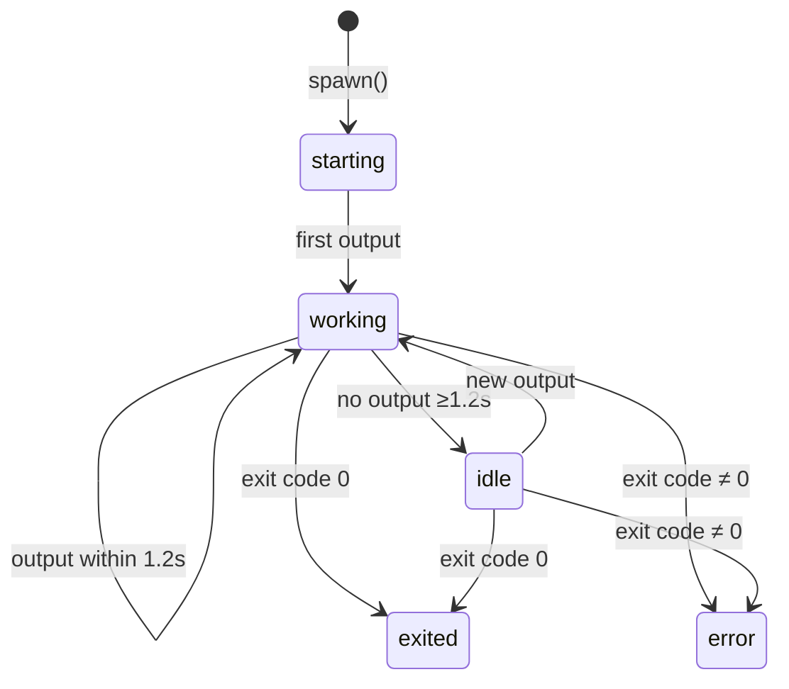

# Wodouyao

Cross-platform infinite canvas terminal orchestrator. Place PTY-backed terminal sessions on a zoomable canvas, wire them together, and observe multi-agent workflows in real time.

Built with **Tauri 2** (Rust) + **React 19** + **TypeScript**.


## Features

### Canvas & Terminals
- **Infinite Canvas** -- Pan (drag / middle-click), zoom (Ctrl+scroll), place terminals anywhere
- **Terminal Nodes** -- PTY-backed terminals on canvas, drag to move, handle to resize
- **Draw to Create** -- Switch to draw mode, drag a rectangle to spawn a terminal
- **Fullscreen** -- F11 or toolbar button (especially useful on Windows)

### Wires & Topology
- **Wire Connections** -- Connect terminals visually; typed wires (`io`, `note`, `file`, `team`)
- **Wire-to-Empty Spawn** -- Drag a wire to empty canvas to auto-spawn a new agent terminal
- **Hub Protocol** -- Local HTTP hub for inter-terminal discovery and communication

### Canvas Resources
- **Sticky Notes** -- Freeform markdown notes on the canvas
- **File Nodes** -- Drag & drop OS files/folders onto canvas (text preview, image preview, directory listing)
- **Resource Layer** -- Notes and files rendered alongside terminals with shared pan/zoom

### Orchestration Panel
- **Role Tags** -- Terminals tagged by role (planner/generator/evaluator/researcher/shell) with color-coded chips
- **Live Status Dots** -- Per-terminal activity indicator (working/idle/starting/exited/error) with pulse animation
- **Task Panel** -- Workspace-scoped task tracker; drag tasks onto terminals to assign
- **Teams** -- Group terminals into named teams with auto-wiring

### Workspaces & Settings
- **Workspaces** -- Save / load / switch full canvas layouts (terminals, wires, tasks, notes)
- **Workspace Fork** -- Clone entire workspace as a parallel experiment branch
- **Per-Terminal Customization** -- 8 accent colors, 5 xterm themes (Tokyo Night, Dracula, Nord, Monokai, Solarized)
- **Terminal Creation Dialog** -- Pick name, color, theme, shell, role, working directory, initial command
- **CLI Agent Detection** -- Auto-detects `claude`, `codex`, `opencode` in PATH; one-click launch
- **Quick Commands** -- Configurable toolbar shortcuts for frequently used commands
- **Command Palette** -- `Ctrl+K` fuzzy search across terminals and actions
- **Context Menu** -- Right-click terminals for rename, color change, wire, fold, copy buffer, close
- **Settings Drawer** -- Workspace directory, quick commands, wire-to-empty spawn config, native file pickers

## Architecture



### Rendering Layers (bottom to top)



### Data Flow



### Terminal Activity State Machine



## Prerequisites

- [Node.js](https://nodejs.org/) >= 18
- [Rust](https://rustup.rs/) (stable toolchain)
- [Tauri CLI](https://v2.tauri.app/start/prerequisites/) v2
- Platform build tools (Visual Studio Build Tools on Windows, Xcode on macOS, etc.)

## Getting Started

```bash
# Install JS dependencies
npm install

# Run in dev mode (hot-reload frontend + Rust backend)
npm run tauri dev

# Build production binary
npm run tauri build

# TypeScript check only
npx tsc --noEmit
```

## Project Structure

```
src/                              # React frontend
  components/
    canvas/                       # InfiniteCanvas, WireLayer, BackgroundLayer, ResourceLayer
                                  # NoteNode, FileNode, DrawPreview, CanvasControls
    terminal/                     # TerminalNode, TerminalBody, TerminalTitleBar
                                  # TerminalStatusBadge, TerminalContextMenu
    ui/                           # Toolbar, SettingsDrawer, TasksDrawer, TeamsDrawer
                                  # WorkspaceSwitcher, TerminalCreateDialog, RolePicker
    command-palette/              # CommandPalette (Ctrl+K)
  hooks/                          # useCanvas, useTerminal, useTerminalIO, useKeyboard
                                  # useWorkspace, useForkWorkspace, useNewTerminal
                                  # useNodeDrag, useTasksSync, useTeamsSync
                                  # useTerminalActivity, useHubSpawn
  store/                          # Zustand stores (terminal, canvas, wire, workspace,
                                  # settings, task, team, note, fileNode, dialog, command)
  services/                       # Tauri IPC wrappers, terminal registry
  types/                          # TypeScript type definitions
  utils/                          # Themes, roles, constants, geometry, ID generation

src-tauri/                        # Rust backend
  src/
    pty/                          # PTY session management (portable-pty)
    commands/                     # Tauri IPC commands (terminal, workspace, settings,
                                  # agents, wire, team, tasks, file_preview)
    hub/                          # Hub server (topology, identity, teams, endpoints)
    workspace/                    # Workspace JSON persistence
    settings/                     # App settings persistence
    tasks/                        # Task store
    integrations/                 # Agent CLI detection (claude, codex)
    state/                        # Shared app state
```

## Keyboard Shortcuts

| Key | Action |
|---|---|
| `Ctrl+K` | Command palette |
| `F11` | Toggle fullscreen |
| `Ctrl+scroll` | Zoom canvas |
| `Middle-click drag` | Pan canvas |
| `Shift+click` "+ Terminal" | Quick-create terminal (skip dialog) |

## Canvas Modes

| Mode | Behavior |
|---|---|
| **Select** | Click-drag on canvas to pan; click-drag terminal title to move |
| **Draw** | Drag a rectangle on canvas to define terminal position/size |
| **Wire** | Click source anchor, drag to target terminal to create connection |

## Role Tags

| Role | Color | Glyph | Purpose |
|---|---|---|---|
| planner | `#bb9af7` | ◆ | Designs plans, writes notes |
| generator | `#9ece6a` | ▲ | Writes code |
| evaluator | `#f7768e` | ◐ | Runs tests, reviews |
| researcher | `#7dcfff` | ? | Explores, asks questions |
| shell | `#565f89` | > | Plain shell (default) |

## Tech Stack

| Layer | Technology |
|---|---|
| Desktop runtime | Tauri 2 |
| Backend | Rust, portable-pty, tiny_http, tokio |
| Frontend | React 19, TypeScript, Vite |
| Terminal emulator | xterm.js 5.5 + Canvas renderer |
| State management | Zustand 5 |
| Canvas background | Konva (pointer-events: none) |

## Acknowledgments

Wodouyao (我都要) is inspired by [TheMaestri.app](https://www.themaestri.app) -- a polished, production-grade terminal orchestrator for macOS. If you're on a Mac, we highly recommend checking it out. This project is an independent, open-source exploration of similar ideas across all platforms. Respect and gratitude to the original TheMaestri team for the inspiration.

## License

MIT
