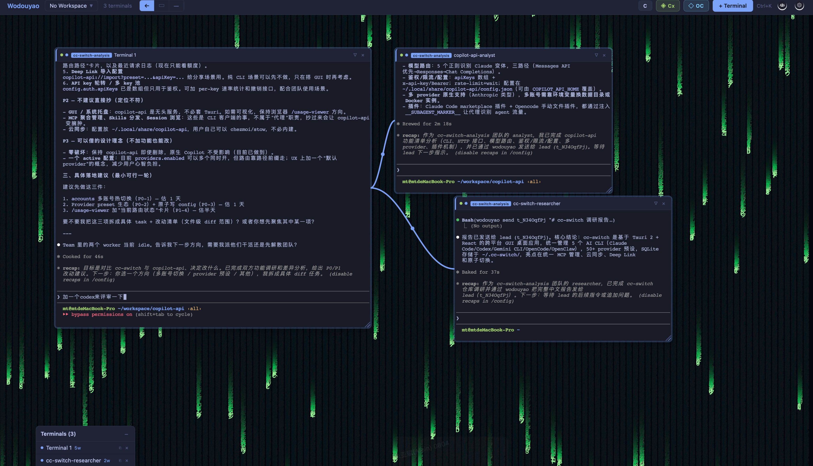

# Wodouyao

Cross-platform infinite canvas terminal orchestrator. Manage multiple terminal sessions on a zoomable, pannable canvas with wire connections between them.

Built with Tauri 2 (Rust) + React 19 + TypeScript.



## Features

- **Infinite Canvas** -- Pan (drag / middle-click), zoom (Ctrl+scroll), place terminals anywhere
- **Terminal Nodes** -- Spawn PTY-backed terminals on the canvas, move and resize freely
- **Draw to Create** -- Switch to draw mode, drag a rectangle, configure and spawn a terminal in that region
- **Wire Connections** -- Connect terminals visually; hover a node's anchor dot or use wire mode
- **Workspaces** -- Save / load / switch full canvas layouts (positions, sizes, wires, CWD)
- **Per-Terminal Customization** -- 8 accent colors, 5 xterm themes (Tokyo Night, Dracula, Nord, Monokai, Solarized)
- **Terminal Creation Dialog** -- Pick name, color, theme, shell, working directory, initial command
- **CLI Agent Detection** -- Auto-detects `claude`, `codex`, `opencode` in PATH; one-click launch
- **Quick Commands** -- Configurable toolbar shortcuts for frequently used commands
- **Command Palette** -- `Ctrl+K` fuzzy search across terminals and actions
- **Context Menu** -- Right-click terminals for rename, color change, wire, fold, copy buffer, close
- **Settings Drawer** -- Default shell, workspace directory, quick command management

## Prerequisites

- [Node.js](https://nodejs.org/) >= 18
- [Rust](https://rustup.rs/) (stable toolchain)
- [Tauri CLI](https://v2.tauri.app/start/prerequisites/) v2
- Platform build tools (Visual Studio Build Tools on Windows, Xcode on macOS, etc.)

## Getting Started

```bash
# Install JS dependencies
npm install

# Run in dev mode (hot-reload frontend + Rust backend)
npm run tauri dev

# Build production binary
npm run tauri build
```

## Project Structure

```
src/                          # React frontend
  components/
    canvas/                   # InfiniteCanvas, WireLayer, CanvasBackground, DrawPreview
    terminal/                 # TerminalNode, TerminalBody, TerminalTitleBar, ContextMenu
    ui/                       # Toolbar, SettingsDrawer, WorkspaceSwitcher, TerminalCreateDialog
    command-palette/          # CommandPalette (Ctrl+K)
  hooks/                      # useCanvas, useTerminal, useTerminalIO, useKeyboard, useWorkspace
  store/                      # Zustand stores (terminal, canvas, wire, workspace, settings, dialog)
  services/                   # Tauri IPC wrappers, terminal registry
  types/                      # TypeScript type definitions
  utils/                      # Themes, constants, geometry, ID generation

src-tauri/                    # Rust backend
  src/
    pty/                      # PTY session management (portable-pty)
    commands/                 # Tauri commands (terminal, workspace, settings, agents)
    workspace/                # Workspace JSON persistence
    settings/                 # App settings persistence
    state/                    # Shared app state
```

## Keyboard Shortcuts

| Key | Action |
|---|---|
| `Ctrl+K` | Command palette |
| `Ctrl+scroll` | Zoom canvas |
| `Middle-click drag` | Pan canvas |
| `Shift+click` "+ Terminal" | Quick-create terminal (skip dialog) |

## Canvas Modes

| Mode | Behavior |
|---|---|
| **Select** | Click-drag on canvas to pan; click-drag terminal title to move |
| **Draw** | Drag a rectangle on canvas to define terminal position/size |
| **Wire** | Click source anchor, drag to target terminal to create connection |

## Tech Stack

| Layer | Technology |
|---|---|
| Desktop runtime | Tauri 2 |
| Backend | Rust, portable-pty, tokio |
| Frontend | React 19, TypeScript, Vite |
| Terminal emulator | xterm.js 5.5 + Canvas renderer |
| State management | Zustand 5 |
| Canvas grid | Konva (pointer-events: none background) |

## Acknowledgments

Wodouyao（我都要）is inspired by [TheMaestri.app](https://www.themaestri.app) -- a polished, production-grade terminal orchestrator for macOS. If you're on a Mac, we highly recommend checking it out. This project is an independent, open-source exploration of similar ideas across all platforms. Respect and gratitude to the original TheMaestri team for the inspiration.

## License

MIT
