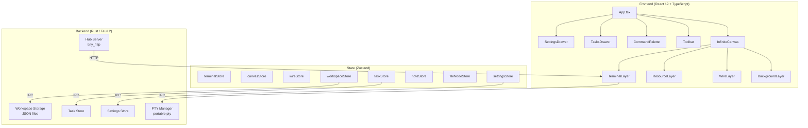
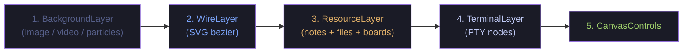
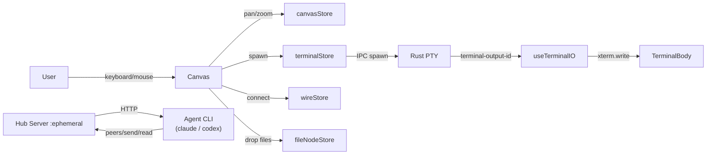
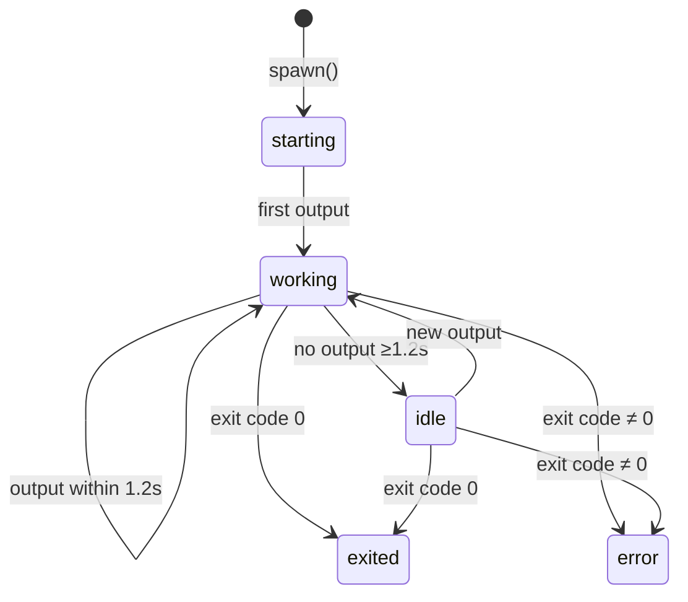

# 我都要 · Wodouyao

> 一块让**碳基**（你）和**硅基**（Agent）盯着同一幅世界的无限画布终端编排器。
> An infinite-canvas terminal orchestrator where **carbon** (you) and **silicon** (agents) stare at the same world.

基于 **Tauri 2**（Rust）+ **React 19** + **TypeScript**。
Built on **Tauri 2** (Rust) + **React 19** + **TypeScript**.


---

## 🧬 双视角 · Two Lenses

Wodouyao 不是harness，是一块**双物种共用的舞台**：
Wodouyao is not a harness — it is a **stage shared between two species**:

- 🧍 **碳基视角 / Carbon-side** — 你贴着屏幕看：活动灯、彩色连线、拖任务到终端、Ctrl+K 召唤命令。
  You lean against the glass: activity dots, colored wires, drag tasks onto terminals, Ctrl+K summons the palette.
- 🤖 **硅基视角 / Silicon-side** — Agent 通过 hub HTTP 接口感知世界：发现 peer、发送按键、读取输出、加入 team。
  Agents reach through the hub HTTP API: discover peers, inject keystrokes, read output, join teams.

同一个终端节点，两种打开方式：
Same terminal node, two ways to open it:

| 场景 / Scene | 🧍 Carbon 看到 / sees | 🤖 Silicon 看到 / sees |
|---|---|---|
| 画布上多出一个终端 / A new terminal appears | 新窗口 + 状态点 + 拖拽把手 / a window with a status dot and drag handles | `/v1/peers` 多出一条 JSON / a new entry in `/v1/peers` JSON |
| 拉一条连线 / Draw a wire | 贝塞尔曲线 + tooltip / bezier curve with tooltip | ACL 白名单新增 peer / an ACL peer was granted |
| 按下回车 / Press Enter | 当前终端执行 / your PTY runs the line | 所有 `io` wire 对端同步收到 `\r` / every `io` peer receives `\r` |

---

## ✨ 特性 · Features

### 🖼 画布与终端 · Canvas & Terminals

- 无限画布，平移/缩放/框选。PTY 真终端，四边四角都能拖，rAF 节流保证丝滑。
  Infinite zoomable canvas. Real PTY terminals, resizable from any edge or corner, rAF-throttled for smoothness.
- WebGL 渲染器（Canvas 兜底）+ JetBrainsMono → SF Mono → Menlo 字体栈。
  WebGL renderer (Canvas fallback) + JetBrainsMono → SF Mono → Menlo font stack.
- 主题（Tokyo Night / Dracula / Nord / Monokai / Solarized）+ 8 色 accent。
  5 xterm themes + 8 accent colors.

### 🪢 连线与 IO · Wires & IO

- Typed wires：`io`（终端↔终端）、`note`、`file`、`board`（任务板）、`team`。
  Typed wires: `io` (terminal↔terminal), `note`, `file`, `board` (task boards), `team`.
- `io` wire 把按键（含 Enter、Ctrl-*、方向键）镜像到对端 PTY —— 真·键盘广播。
  `io` wires mirror every keystroke (Enter, Ctrl-*, arrows) to the peer PTY — true input fan-out.
- 拖线落到空白处，自动孵化一个带 `claude`/`codex` 的 agent 终端。
  Drop a wire on empty canvas to auto-spawn an agent terminal (configurable command).

### 🛰 硅基协议 · Silicon Protocol (Hub)

- 内嵌 `tiny_http` hub，loopback 随机端口，Bearer 认证。
  Embedded `tiny_http` hub on an ephemeral loopback port, Bearer-authenticated.
- 端点 · Endpoints：`/v1/peers` `/v1/whoami` `/v1/send` `/v1/read` `/v1/watch` `/v1/spawn` `/v1/teams/*` `/v1/tasks/*`。
- 附带 POSIX `wodouyao` CLI + Claude Code / Codex 技能，安装即识别。
  Ships a POSIX `wodouyao` CLI and Claude Code / Codex skills that auto-install.
- tmux 风格按键字面量解析器：`Enter` / `C-c` / `C-Left` / `Escape`。
  tmux-style key-literal parser (`Enter`, `C-c`, `C-Left`, `Escape`).

### 🎭 编排面板 · Orchestration Panel

- 角色标签（planner / generator / evaluator / researcher / shell）带颜色和字符。
  Role tags with color glyphs.
- 活动指示（working / idle / starting / exited / error），脉冲动画。
  Activity dots with pulse animation.
- 任务面板，拖任务到终端即分派；任务板本身可连线。
  Task panel with drag-to-assign; task boards themselves can be wired.
- 团队（star topology，lead 为 wire 源）+ 调色板光晕。
  Teams with star topology (lead = wire source) and palette auras.

### 💾 工作区 & 设置 · Workspaces & Settings

- 保存 / 加载 / 切换完整画布（终端 + wire + task + note + team）。
  Save / load / switch full canvas layouts (terminals + wires + tasks + notes + teams).
- Fork 工作区，做平行实验分支。
  Fork a workspace as a parallel experiment branch.
- 背景：图片 / 视频 / URL / 粒子（matrix / starfield / wave / dust）。
  Backgrounds: image / video / URL / particle preset.
- 语言切换（中文 / English），shell 选择，字号，默认创建行为，wire-to-empty 配置。
  Language switch (zh / en), shell picker, font size, default create behavior, wire-to-empty config.

---

## 🚧 优化清单 · Optimization Backlog

### 🧍 碳基想要的 · What carbon wants

1. **上手引导 / Onboarding tour** — 首次启动交互式演示 spawn → wire → team。
   Interactive first-run tour demonstrating spawn → wire → team.
2. **撤销栈 / Undo stack** — 误删终端或 wire 后 `⌘Z` 恢复。
   `⌘Z` to restore an accidentally deleted terminal or wire.
3. **键盘优先 / Keyboard-first** — 方向键在终端间跳、`⌘/` 切 palette、Tab 轮换焦点。
   Arrow-navigate between terminals, `⌘/` toggle palette, Tab cycle focus.
4. **操作反馈 / Toasts** — 自动保存、workspace 切换、hub 安装结果要能看见。
   Toast feedback for auto-save, workspace switch, hub install outcomes.
5. **可访问性 / A11y** — aria-label、高对比主题、屏幕阅读器友好的 wire 描述。
   aria-labels, high-contrast theme, screen-reader-friendly wire summaries.
6. **亮色主题 / Light theme** — 白昼党的出路（目前深色硬编码）。
   A light theme for daylight users (dark is hardcoded today).
7. **自定义主题 & 字体 / Custom themes & fonts** — 让用户导入自己的 xterm theme 和字体。
   Let users import their own xterm themes and font families.
8. **触控板手势 / Trackpad gestures** — pinch-to-zoom、双指平移的精调。
   Polish pinch-zoom and two-finger pan.
9. **用户文档 / User handbook** — 面向"把它当工具使"的非开发者手册。
   A handbook aimed at non-developers using it as a tool.
10. **错误上浮 / Surface errors** — Rust 端 error 不再只进 DevTools console。
    Surface Rust-side errors outside of DevTools.

### 🤖 硅基想要的 · What silicon wants

1. **Per-terminal scope token** — 全局 bearer → 按 `WODOUYAO_ID` 分发 scoped token，按 peer ACL 收紧。
   Replace the single global bearer with per-terminal scoped tokens honoring the peer ACL.
2. **心跳 / Heartbeat** — `POST /v1/heartbeat`，stale agent 自动标灰。
   Heartbeat endpoint so disconnected agents are flagged stale.
3. **幂等键 / Idempotency** — `/v1/send` 接受 `Idempotency-Key`，网络重传不重复执行。
   Accept `Idempotency-Key` on `/v1/send` to survive retries.
4. **Batch / atomic 操作** — 一次 "spawn + wire + send" 的原子接口，避免中间态。
   Atomic batch endpoint for spawn + wire + send.
5. **速率限制 / Rate limit** — 429 + `Retry-After`，防止 burst 把 PTY 写爆。
   Rate limit with 429 + `Retry-After`.
6. **更丰富的 peer 元数据 / Richer peer metadata** — role / shell / cwd / status / cols×rows 都放进 `/v1/peers`。
   Include role / shell / cwd / status / cols×rows in `/v1/peers`.
7. **Watch 续传 / Resumable watch** — `since=<offset>`，断线不丢输出。
   Resumable watch via `since=<offset>`.
8. **OpenAPI schema** — 发布 OpenAPI，让 agent 自动生成 client。
   Publish OpenAPI so clients can be generated.
9. **身份持久化 / Identity persistence** — 重启后 identity 不丢。
   Persist identities across restarts.
10. **结构化错误 / Structured errors** — 统一 `{code, message, hint}` 响应体。
    Normalize errors to `{code, message, hint}`.
11. **Metrics 端点 / Metrics endpoint** — 让 agent 自查吞吐和 peer 活跃度。
    A `/v1/metrics` endpoint for self and peer observability.
12. **版本协商 / Media-type versioning** — `Accept: application/vnd.wodouyao.v1+json`。
    Media-type versioning to allow breaking changes.
13. **前端测试 + CI / Frontend tests + CI** — 补 Vitest 和 GitHub Actions；目前仅 Rust 集成测试。
    Add Vitest and GitHub Actions; only Rust integration tests exist today.
14. **结构化日志 / Structured logs** — `println` → `tracing` JSON。
    Replace `println!`/`eprintln!` with structured `tracing` logs.
15. **因果追踪 / Causality tracing** — "A 按了 Enter → B 的 prompt 刷新"需要 span/trace ID 贯通。
    Propagate span IDs across mirrored input so cross-terminal causality is traceable.

---

## 🏛 架构 · Architecture



### 渲染层级 · Rendering Layers (bottom → top)



### 数据流 · Data Flow



### 终端活动状态机 · Terminal Activity State Machine



---

## 🧰 开始 · Getting Started

### 先决条件 · Prerequisites

- [Node.js](https://nodejs.org/) >= 18
- [Rust](https://rustup.rs/) (stable)
- [Tauri CLI](https://v2.tauri.app/start/prerequisites/) v2
- 平台构建工具：Windows 用 Visual Studio Build Tools，macOS 用 Xcode。
  Platform toolchain: Visual Studio Build Tools (Windows), Xcode (macOS).

### 命令 · Commands

```bash
# 安装依赖 / Install JS deps
npm install

# 开发模式（前端热更新 + Rust 后端） / Dev mode
npm run tauri dev

# 生产构建 / Production build
npm run tauri build

# 仅 TypeScript 检查 / TypeScript check only
npx tsc --noEmit
```

---

## 📁 项目结构 · Project Structure

```
src/                              # React frontend
  components/
    canvas/                       # InfiniteCanvas, WireLayer, BackgroundLayer, ResourceLayer
                                  # NoteNode, FileNode, TaskBoardNode, CanvasControls
    terminal/                     # TerminalNode, TerminalBody, TerminalTitleBar
                                  # TerminalStatusBadge, TerminalContextMenu
    ui/                           # Toolbar, SettingsDrawer, TasksDrawer, TeamsDrawer
                                  # WorkspaceSwitcher, TerminalCreateDialog, RolePicker
    command-palette/              # CommandPalette (Ctrl+K)
  hooks/                          # useCanvas, useTerminal, useTerminalIO, useKeyboard
                                  # useWorkspace, useForkWorkspace, useNewTerminal
                                  # useNodeDrag, useTasksSync, useTeamsSync
                                  # useTerminalActivity, useHubSpawn
  store/                          # Zustand stores (terminal, canvas, wire, workspace,
                                  # settings, task, team, note, fileNode, taskBoard, ...)
  services/                       # Tauri IPC wrappers, terminal registry
  types/                          # TypeScript types
  utils/                          # Themes, roles, constants, geometry, ID gen
  i18n/                           # en.json / zh.json + index.ts

src-tauri/                        # Rust backend
  src/
    pty/                          # PTY session management (portable-pty)
    commands/                     # Tauri IPC commands (terminal, workspace, settings,
                                  # agents, wire, team, tasks, file_preview)
    hub/                          # Hub HTTP server, topology, identity, teams, keys
    workspace/                    # Workspace JSON persistence
    settings/                     # App settings persistence
    tasks/, notes/                # Resource stores
    integrations/                 # Agent CLI detection + skill installer
  resources/bin/wodouyao          # Shipped POSIX CLI
  resources/skills/wodouyao/      # Shipped Claude Code / Codex skill
  tests/hub_integration.rs        # Rust integration tests
```

---

## ⌨️ 快捷键 · Shortcuts

| 键 / Key | 动作 / Action |
|---|---|
| `Ctrl+K` | 命令面板 / Command palette |
| `F11` | 切换全屏 / Toggle fullscreen |
| `Ctrl+scroll` | 缩放画布 / Zoom canvas |
| 中键拖动 / Middle-click drag | 平移画布 / Pan canvas |
| `Shift+click` "+ Terminal" | 跳过创建对话框 / Skip the create dialog |

## 🧭 画布模式 · Canvas Modes

| 模式 / Mode | 行为 / Behavior |
|---|---|
| **Select** | 画布上拖动即平移；点标题栏移动终端。Drag canvas to pan; drag title to move terminal. |
| **Draw** | 拖一个矩形生成终端。Drag a rectangle to spawn a terminal. |
| **Wire** | 点源 anchor，拖到目标节点连线。Click source anchor, drag to target node. |

## 🎨 角色标签 · Role Tags

| 角色 / Role | 颜色 / Color | 字符 / Glyph | 用途 / Purpose |
|---|---|---|---|
| planner | `#bb9af7` | ◆ | 设计方案 / designs plans |
| generator | `#9ece6a` | ▲ | 写代码 / writes code |
| evaluator | `#f7768e` | ◐ | 跑测试、审稿 / runs tests, reviews |
| researcher | `#7dcfff` | ? | 探索、提问 / explores, asks |
| shell | `#565f89` | > | 普通 shell（默认）/ plain shell (default) |

## 🧱 技术栈 · Tech Stack

| 层 / Layer | 技术 / Tech |
|---|---|
| 桌面运行时 / Desktop runtime | Tauri 2 |
| 后端 / Backend | Rust, portable-pty, tiny_http, tokio |
| 前端 / Frontend | React 19, TypeScript, Vite |
| 终端 emulator | xterm.js 5.5 + WebGL renderer (Canvas fallback) |
| 状态管理 / State | Zustand 5 |
| 国际化 / i18n | react-i18next (en / zh) |

---

## 🙏 致谢 · Acknowledgments

Wodouyao（我都要）的灵感来自 [TheMaestri.app](https://www.themaestri.app) —— 一款打磨精细的 macOS 终端编排器。如果你在 Mac 上，非常推荐去看看。这个项目是对相似想法的独立、开源、跨平台探索。向原作者致敬。

Wodouyao is inspired by [TheMaestri.app](https://www.themaestri.app) — a polished, production-grade macOS terminal orchestrator. If you're on a Mac, do check it out. This project is an independent, open-source, cross-platform exploration of related ideas. Respect and gratitude to the original team.

## License

MIT
