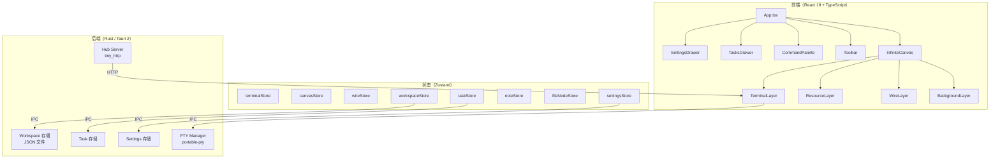
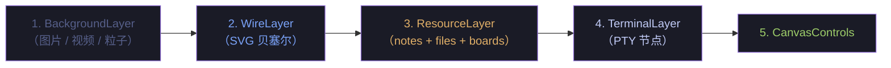
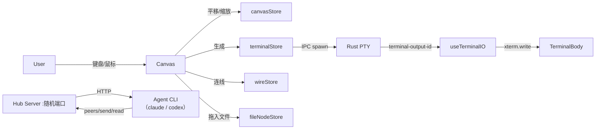
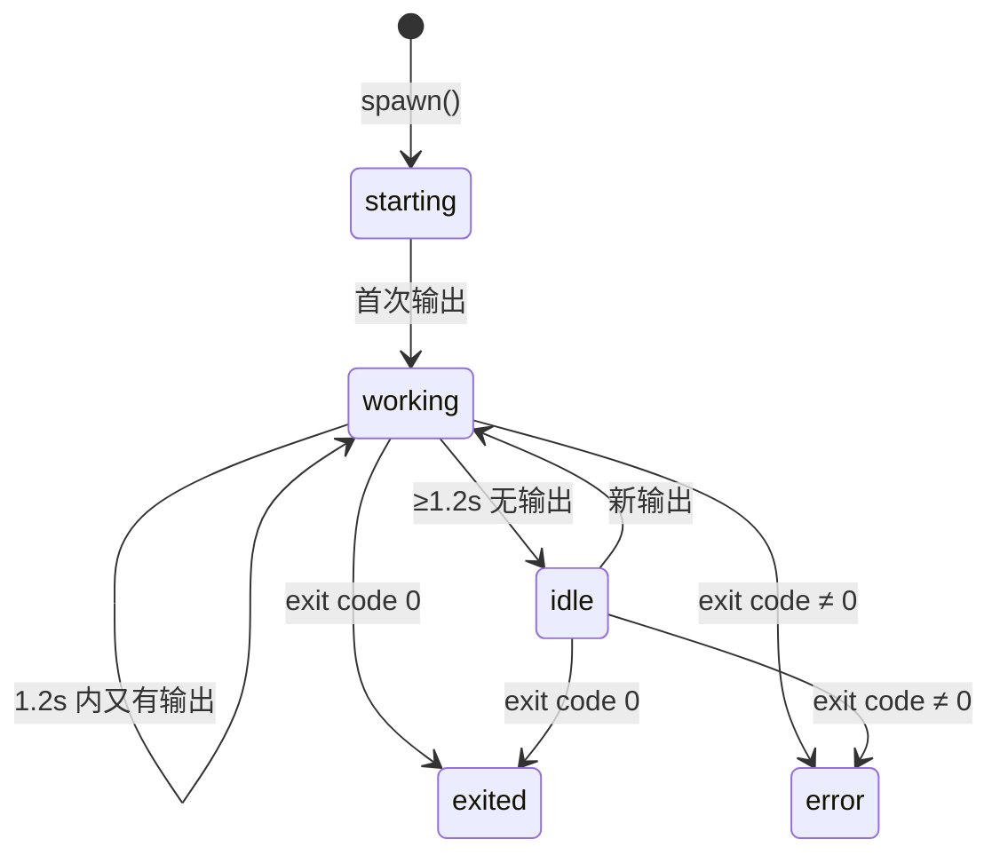

# 我都要 · Wodouyao

[English](./README.md) · [中文](./README_zh.md)

> 一块让**碳基**（你）和**硅基**（Agent）盯着同一幅世界的无限画布终端编排器。

基于 **Tauri 2**（Rust）+ **React 19** + **TypeScript**。


---

## 🧬 双视角

Wodouyao 不是 harness，它是一块**双物种共用的舞台**：

- 🧍 **碳基视角** — 你贴着屏幕看：活动指示灯、彩色连线、把任务拖到终端、`Ctrl+K` 召唤命令面板。
- 🤖 **硅基视角** — Agent 通过 hub HTTP 接口感知世界：发现 peer、发送按键、读取输出、加入 team。

同一个终端节点，两种打开方式：

| 场景 | 🧍 碳基看到 | 🤖 硅基看到 |
|---|---|---|
| 画布上多出一个终端 | 一个带状态点和拖拽把手的窗口 | `/v1/peers` 里多出一条 JSON |
| 拉一条连线 | 一条贝塞尔曲线，附带 tooltip | ACL 白名单新增了一个 peer |
| 按下回车 | 当前 PTY 执行这一行 | 所有 `io` peer 同步收到 `\r` |

---

## ✨ 特性

### 🖼 画布与终端

- 无限画布，自由平移/缩放/框选。PTY 真终端，四边四角都能拖动调整尺寸，rAF 节流保证丝滑。
- WebGL 渲染器（Canvas 兜底） + JetBrainsMono → SF Mono → Menlo 字体栈。
- 5 款 xterm 主题（Tokyo Night / Dracula / Nord / Monokai / Solarized） + 8 种 accent 色。

### 🪢 连线与 IO

- Typed wires：`io`（终端↔终端）、`note`、`file`、`board`（任务板）、`team`。
- `io` wire 把每一次按键（Enter、Ctrl-*、方向键）镜像到对端 PTY —— 真·键盘广播。
- 拖线到空白画布，自动孵化一个带 `claude` / `codex` 的 agent 终端（命令可配置）。

### 🛰 硅基协议（Hub）

- 内嵌 `tiny_http` hub，监听 loopback 随机端口，Bearer 认证。
- 端点：`/v1/peers`、`/v1/whoami`、`/v1/send`、`/v1/read`、`/v1/watch`、`/v1/spawn`、`/v1/teams/*`、`/v1/tasks/*`。
- 附带 POSIX 的 `wodouyao` CLI 和 Claude Code / Codex 技能，安装即可用。
- tmux 风格按键字面量解析器：`Enter`、`C-c`、`C-Left`、`Escape` 全识别。

### 🎭 编排面板

- 角色标签（planner / generator / evaluator / researcher / shell），带颜色和字符。
- 活动指示灯（working / idle / starting / exited / error），脉冲动画。
- 任务面板，可把任务拖到终端分派；任务板本身也能连线。
- 团队（star topology，lead 为 wire 源）+ 调色板光晕。

### 💾 工作区 & 设置

- 保存 / 加载 / 切换完整画布（终端 + wire + task + note + team）。
- Fork 工作区，当成平行实验分支。
- 背景：图片 / 视频 / URL / 粒子（matrix / starfield / wave / dust）。
- 语言切换（中文 / English）、shell 选择、字号、默认创建行为、wire-to-empty 配置。

---

## 🚧 优化清单

### 🧍 碳基想要的

1. **上手引导** — 首次启动的交互式 tour，演示 spawn → wire → team。
2. **撤销栈** — `⌘Z` 恢复误删的终端或 wire。
3. **键盘优先** — 方向键在终端间跳转，`⌘/` 切换 palette，Tab 轮换焦点。
4. **操作反馈** — 自动保存、workspace 切换、hub 安装都用 toast 呈现结果。
5. **可访问性** — aria-label、高对比主题、屏幕阅读器友好的 wire 描述。
6. **亮色主题** — 给喜欢白昼的人一个出路（目前深色硬编码）。
7. **自定义主题 & 字体** — 让用户导入自己的 xterm theme 和字体族。
8. **触控板手势** — pinch-to-zoom、双指平移的精调。
9. **用户手册** — 面向"把它当工具使"的非开发者说明书。
10. **错误上浮** — Rust 端 error 不再只进 DevTools console。

### 🤖 硅基想要的

1. **Per-terminal scope token** — 把全局 bearer 替换成按 terminal 的 scoped token，配合 peer ACL 收紧权限。
2. **心跳** — `POST /v1/heartbeat`，agent 断线自动被标灰。
3. **幂等键** — `/v1/send` 接受 `Idempotency-Key`，网络重传不重复执行。
4. **原子 batch** — 一次性 spawn + wire + send 的原子接口，避免中间态。
5. **速率限制** — 429 + `Retry-After`，防止 burst 把 PTY 写爆。
6. **更丰富的 peer 元数据** — role / shell / cwd / status / cols×rows 全塞进 `/v1/peers`。
7. **Watch 断点续传** — 带 `since=<offset>`，断线不丢输出。
8. **OpenAPI schema** — 发布 OpenAPI，让 agent 自动生成 client。
9. **身份持久化** — 重启后 identity 不丢，peer 记忆延续。
10. **结构化错误** — 统一 `{code, message, hint}` 错误体。
11. **Metrics 端点** — `/v1/metrics`，让 agent 自查吞吐和 peer 活跃度。
12. **版本协商** — `Accept: application/vnd.wodouyao.v1+json`，便于升级不撕裂。
13. **前端测试 + CI** — 补 Vitest 和 GitHub Actions；目前仅 Rust 集成测试。
14. **结构化日志** — `println!`/`eprintln!` 换成 `tracing` JSON。
15. **因果追踪** — "A 按了 Enter → B 的 prompt 刷新"需要 span/trace ID 贯通。

---

## 🏛 架构



### 渲染层级（自下而上）



### 数据流



### 终端活动状态机



---

## 🧰 上手

### 先决条件

- [Node.js](https://nodejs.org/) >= 18
- [Rust](https://rustup.rs/)（stable）
- [Tauri CLI](https://v2.tauri.app/start/prerequisites/) v2
- 平台构建工具：Windows 用 Visual Studio Build Tools，macOS 用 Xcode。

### 命令

```bash
# 安装 JS 依赖
npm install

# 开发模式（前端热更新 + Rust 后端）
npm run tauri dev

# 生产构建
npm run tauri build

# 仅 TypeScript 检查
npx tsc --noEmit
```

### Headless 服务器模式（浏览器端 UI）

同一份 Rust 核心也能以 headless HTTP+WebSocket 服务器形态启动，从
**另一台机器的浏览器**操作画布——PTY 终端、Claude / Codex 会话、
hub 全部在服务器侧跑。典型场景：SSH 隧道到工作站，部署到远端开发
机，或者就是想让会话长期挂着、关浏览器后再开。

```bash
# 后台启动（自动 build SPA + cargo --release + nohup），脱离启动
# 它的 shell；URL 打印一次后 bookmark 即可永久使用。
npm run server:start

npm run server:status   # 看 pid + URL
npm run server:logs     # tail -f .wodouyao-runtime/server.log
npm run server:stop     # 优雅停止（SIGTERM 2s 超时退化 SIGKILL）

# 前台变体（开发用，日志直接打在 terminal 里）：
npm run server:dev
```

`server:start` 打印的 URL 是**稳定**的——端口和 token 跨重启都不变：

```
wodouyao-server listening at:
  http://127.0.0.1:19799/#token=23d31e67-…
```

- **端口**默认 `19799`，可用 `WODOUYAO_WEB_PORT` 覆盖；设成 `0` 退回
  随机端口
- **Token** 持久化在 `~/.wodouyao/web-token`（0600 权限，首次运行生
  成），用 `WODOUYAO_WEB_TOKEN` 临时覆盖；要轮换就删文件再重启

浏览器打开这个 URL 就行。前端把 `#token=…` 抠出来放进 sessionStorage，
后续 `/v1/cmd/*` 走 fetch、`/v1/events` 走 WebSocket，都拿这个 token 鉴权。

远程使用走 SSH 隧道（端口稳定意味着这条命令永久有效）：

```bash
ssh -L 19799:127.0.0.1:19799 your-server
# 本地浏览器: 收藏 http://127.0.0.1:19799/#token=…
```

**PTY 会话在关闭浏览器后继续运行**。daemon 持有 `PtyManager`，关浏
览器只是断开 WebSocket。下次再开 tab，原有终端都还在跑。刷新和切换
workspace 也是幂等的——server 看到 id 已经活着就直接复用，不会杀掉
重建（新 xterm 显示是空的，但底层进程没换）。

headless binary 只监听 `127.0.0.1`，**程序内不做 TLS，不做多租户隔
离**。把 bearer token 当共享密钥用，公网部署前置 TLS 反代。这个模
式定位**单用户远程访问**，不是多租户 SaaS。

其他环境变量：
- `WODOUYAO_DIST_DIR` — SPA bundle 位置（默认 binary 同目录下的
  `dist/`）
- `WODOUYAO_RESOURCE_DIR` — bundled `wodouyao` CLI 位置（默认 binary
  父目录；开发时设为 `$PWD/src-tauri`，让 PTY 在 PATH 里找到
  `resources/bin/wodouyao`）

---

## 📁 项目结构

```
src/                              # React 前端
  components/
    canvas/                       # InfiniteCanvas, WireLayer, BackgroundLayer, ResourceLayer
                                  # NoteNode, FileNode, TaskBoardNode, CanvasControls
    terminal/                     # TerminalNode, TerminalBody, TerminalTitleBar
                                  # TerminalStatusBadge, TerminalContextMenu
    ui/                           # Toolbar, SettingsDrawer, TasksDrawer, TeamsDrawer
                                  # WorkspaceSwitcher, TerminalCreateDialog, RolePicker
    command-palette/              # CommandPalette（Ctrl+K）
  hooks/                          # useCanvas, useTerminal, useTerminalIO, useKeyboard
                                  # useWorkspace, useForkWorkspace, useNewTerminal
                                  # useNodeDrag, useTasksSync, useTeamsSync
                                  # useTerminalActivity, useHubSpawn
  store/                          # Zustand stores (terminal, canvas, wire, workspace,
                                  # settings, task, team, note, fileNode, taskBoard, ...)
  services/                       # Tauri IPC 包装、终端注册表
  types/                          # TypeScript 类型
  utils/                          # 主题、角色、常量、几何、ID 生成
  i18n/                           # en.json / zh.json + index.ts

src-tauri/                        # Rust 后端
  src/
    pty/                          # PTY 会话管理（portable-pty）
    commands/                     # Tauri IPC 命令（terminal, workspace, settings,
                                  # agents, wire, team, tasks, file_preview）
    hub/                          # Hub HTTP 服务、拓扑、身份、teams、keys
    workspace/                    # Workspace JSON 持久化
    settings/                     # 应用设置持久化
    tasks/, notes/                # 资源存储
    integrations/                 # Agent CLI 检测 + 技能安装器
  resources/bin/wodouyao          # 随包 POSIX CLI
  resources/skills/wodouyao/      # 随包 Claude Code / Codex 技能
  tests/hub_integration.rs        # Rust 集成测试
```

---

## ⌨️ 快捷键

| 键 | 动作 |
|---|---|
| `Ctrl+K` | 命令面板 |
| `F11` | 切换全屏 |
| `Ctrl+scroll` | 缩放画布 |
| 中键拖动 | 平移画布 |
| `Shift+click` "+ Terminal" | 跳过创建对话框 |

## 🧭 画布模式

| 模式 | 行为 |
|---|---|
| **Select** | 画布上拖动即平移；点终端标题栏可移动。 |
| **Draw** | 拖一个矩形生成终端。 |
| **Wire** | 点源 anchor，拖到目标节点连线。 |

## 🎨 角色标签

| 角色 | 颜色 | 字符 | 用途 |
|---|---|---|---|
| planner | `#bb9af7` | ◆ | 设计方案 |
| generator | `#9ece6a` | ▲ | 写代码 |
| evaluator | `#f7768e` | ◐ | 跑测试、审稿 |
| researcher | `#7dcfff` | ? | 探索、提问 |
| shell | `#565f89` | > | 普通 shell（默认） |

## 🧱 技术栈

| 层 | 技术 |
|---|---|
| 桌面运行时 | Tauri 2 |
| 后端 | Rust、portable-pty、tiny_http、tokio |
| 前端 | React 19、TypeScript、Vite |
| 终端模拟器 | xterm.js 5.5 + WebGL 渲染器（Canvas 兜底） |
| 状态管理 | Zustand 5 |
| 国际化 | react-i18next（en / zh） |

---

## 🙏 致谢

Wodouyao（我都要）的灵感来自 [TheMaestri.app](https://www.themaestri.app) —— 一款打磨精细的 macOS 终端编排器。如果你在 Mac 上，非常推荐去看看。这个项目是对相似想法的独立、开源、跨平台探索。向原作者致敬。

## License

MIT
